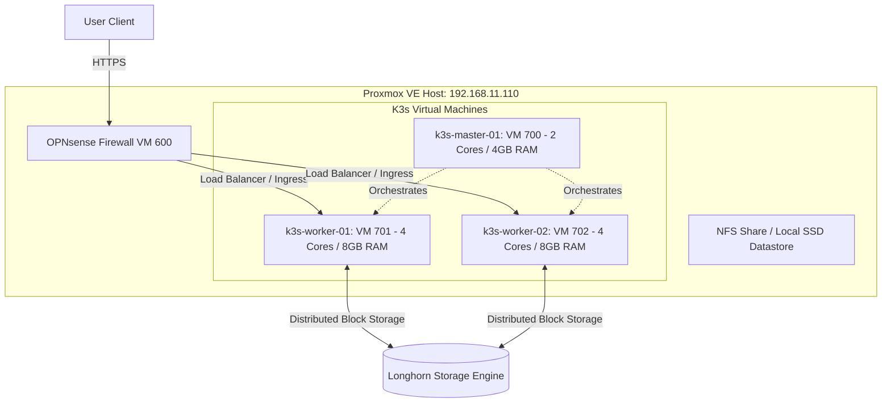

# Migration Proposal: Multi-Node K3s Cluster Migration

This proposal outlines the plan to transition critical applications on your personal home server from standalone LXC containers and VMs to a nested, highly available, and self-healing **K3s (lightweight Kubernetes)** cluster on your Proxmox VE hypervisor.

---

## 1. Target Cluster Topology

To balance resource consumption on your physical hardware against the high availability requirements of critical applications, we propose a **3-Node Cluster** topology using optimized QEMU Virtual Machines (rather than LXCs, to ensure full cgroup v2 compatibility and nested container isolation).



### Resource Requirements (Host Commitments):
*   **Total vCPUs:** 10 virtual cores.
*   **Total RAM:** 20 GB dedicated memory.
*   **Disk Footprint:** 100 GB base OS storage + dynamic persistent storage.

---

## 2. Infrastructure & Storage Architecture

### Storage Layer (Longhorn vs. NFS)
1.  **Block Storage (Longhorn):**
    *   *Usage:* Databases, configuration stores (e.g. Authelia, Grafana).
    *   *Design:* Longhorn will run as a daemonset across the worker nodes, pooling unallocated local virtual disks and replicating data synchronously across Worker 1 and Worker 2. If one node fails, the service can immediately attach the replicated volume on the surviving node.
2.  **Shared Filesystem (NFS/SMB):**
    *   *Usage:* Plex media storage.
    *   *Design:* Mount existing Proxmox NFS datasets directly into pods via Kubernetes Persistent Volumes (PV).

### Ingress & Network Management
*   **CNI Plugin:** **Flannel** (default, low CPU footprint) or **Cilium** (if we want advanced network policies and eBPF observability).
*   **Ingress Controller:** **Traefik** or **Caddy Ingress Controller** (using Caddy to mirror your current proxy configurations).
*   **IP Management (Kube-VIP):** Assigns a virtual IP (e.g. `192.168.11.70`) shared between the master and worker nodes to act as a highly available load balancer front-end.

---

## 3. Migration Roadmap (Step-by-Step)

### Phase 1: Virtual Machine Provisioning
1.  Create a Terraform module `k3s_nodes.tf` in your `proxmox` repository defining three Debian 12 cloud-init VMs.
2.  Pre-allocate virtual disks, configure SSH authorized keys, and set static IPs:
    *   `k3s-master-01`: `192.168.11.70`
    *   `k3s-worker-01`: `192.168.11.71`
    *   `k3s-worker-02`: `192.168.11.72`

### Phase 2: Cluster Bootstrapping
1.  Install K3s on the master node without Traefik or local-path-provisioner to keep configurations clean:
    ```bash
    curl -sfL https://get.k3s.io | sh -s - --disable traefik --disable local-storage
    ```
2.  Fetch the Kubeconfig file and join the worker nodes using the token.
3.  Deploy Kube-VIP to load-balance traffic to the ingress points.

### Phase 3: Storage & Ingress Deployments
1.  Apply Longhorn YAML configurations to bootstrap distributed storage.
2.  Deploy the Ingress Controller and configure Cert-Manager to dynamically request Let's Encrypt TLS certificates using DNS challenges.

### Phase 4: Application Migration (Authelia, Databases, Wazuh)
1.  **Backup Data:** Run snapshots and export configuration dumps from the current LXCs.
2.  **Write manifests:** Convert current configurations into standard Helm charts or Kubernetes YAML deployments:
    *   Configmaps for environment variables.
    *   Secrets (using Vault CSI secret injectors) for credentials.
    *   Persistent Volume Claims (PVC) linking to Longhorn storage.
3.  **Deploy and Sync:** Deploy the pods, copy configuration databases into the active volumes, and verify service checks.

### Phase 5: DNS Cutover
1.  Update the Caddy proxy blocks (or router DNS bindings) to point the wildcard routes (`*.example.com`) to the Kube-VIP virtual load balancer IP.
2.  Monitor logs via Wazuh to confirm secure client traffic redirection.

---

## 4. Key Security & GPU Considerations

### GPU Passthrough for Plex/Ollama Pods
*   *Requirement:* Plex and Ollama pods require access to the physical Nvidia GPU (RTX 2070 Super / future upgrades).
*   *Action:* Install the **Nvidia Container Toolkit** on the K3s worker VMs and deploy the **Nvidia Device Plugin** for Kubernetes. This exposes GPU resources to pods via:
    ```yaml
    resources:
      limits:
        nvidia.com/gpu: 1
    ```
